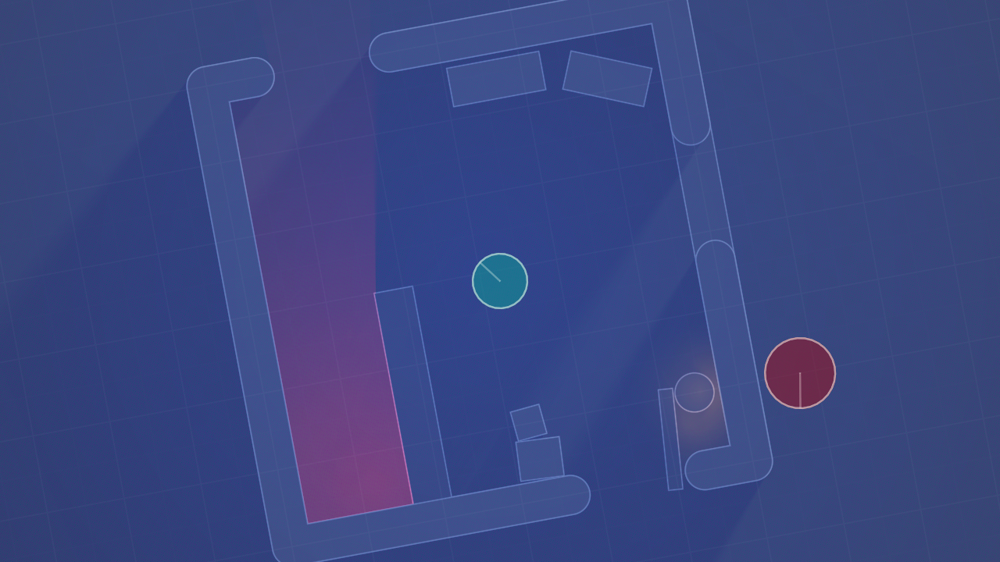
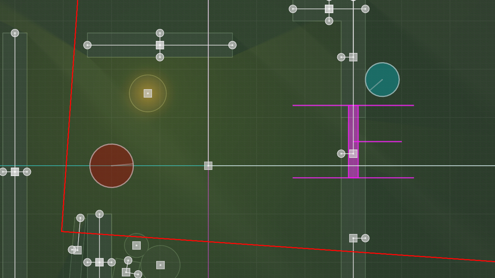

# Dead by Default

A top-down 2D exploration of the asymmetrical multiplayer genre primarily based on Behaviour Interactive's Dead by Daylight. Written using the LÖVE engine, this project is intended as a de-make for non-commercial use.

In summary, gameplay is intended to demonstrate the core or "default" aspects of the base experience and any additional changes are presented as explorations of the asymmetrical genre. Balance changes are explored with the intent of encouraging game health and competitive sportsmanship.

The game is __not__ playable at this point, and is currently a blasting ground for engine features. It always has and will be a hobbyist's technical demonstration and will remain a free, open-source project *for educational and creative purposes.*

# Engine Goals

- top-down 2D perspective
- dynamic lighting & visibility occlusion
- map editing and sharing tools
- rollback netcode
- learning <3

# Current Features

- signed distance fields for rendering and collision
- cone-marched lighting: gamma-correct, dithered, supports transparency and layering
- basic drag-and-draw map editor
- ring-buffer based engine core for deterministic rollback
- pretty low on the spaghetti meter tbh

# Gameplay

When the "game" itself is ready to be played...
- the primary game loop will most likely stay un-touched: survivors do gens, open gates & leave the trial, killer tries to hook them
- most perks, powers, offerings and addons may be re-worked or entirely stripped in an attempt to improve the health of the game
- exhaustion, hex and token collecting perks will still have a place, don't worry
- auxiliary objectives such as chests & totems may be completely re-worked to explore new gameplay ideas
- currency based progression will be re-worked so that most perks and offerings are readily available to all players
- items will not be brought into a trial, they will be found by searching chests
- flashlights may be simplified to make their use more intuitive
- no bloodpoints or player progression will be required, everything is unlocked
- action speeds may vary as a *last resort* for balance issues

# Map Design

- maps will still be made from randomly sorted structure tiles, but may undergo drastic layout changes to explore new gameplay ideas
- random variance of palette counts will be sternly adjusted to suit balance
- large areas may be barred off before an objective is completed, creating movement over the course of a match
- light level may vary across groups of tiles, creating risky traps or dead-zones of barren exposure

# Visibility Occlusion?

- killers view from a cone centered on their character, survivors view from a cone centered behind them (allows peeking around structures)
- players will not see through walls or over tall objects
- killers will not see over short walls but survivors can, and may crouch to avoid detection
- areas outside of visibility will be dim and will not reveal interactable objects or surface details (see: Darkwood)

# Controls

| Play ||
| :---: | :---: |
| WASD | Move |
| Mouse | Aim |
| LMB | Interact* |
| RMB | Power* |
| LShift | Run |
| LCtrl / C | Crouch |
| Space | Action |
| E | Ability* |
| R | Drop* |
| Esc | Menu |
| M | Fullscreen |
| Backspace | Edit Mode |

\* Unimplemented  

| Edit ||
| :---: | :---: |
| Mouse 1 | Select / Move |
| Mouse 2 | Create / Delete |
| Mouse 3 | Pan |
| Wheel | Zoom |
| 1 | No Tool |
| 2 | Circle |
| 3 | Box |
| 4 | Line |
| 5 | Light |
| 6 | Vault |
| Del | Delete |
| Ctrl + Z | Undo |
| Ctrl + Shift + Z | Redo |
| J | Save |
| K | Load |
| Esc | Deselect |
| LCtrl | Snap |
| M | Fullscreen |
| Enter | Play Mode |

# Currently working on...

Editor Improvements
- moving tools to a toolbar menu
- property editing through a menu widget
- better brush placement options (by corners or by edges w/wo radius etc.)
- undo / redo history buffer :heavy_check_mark:
- selection system :heavy_check_mark:
- radius handling :heavy_check_mark:
- selection groups and lock toggles
- selection and visibility filters
- grid-snapped crosshair :heavy_check_mark:
- multi-handle transform
- property painter tool
- color picker widget

Color Improvements
- moving to an HSV / HSL based system
- map-wide color correction

Shader Improvements
- visibility occlusion :heavy_check_mark:
- single uniform list for more objects per blend layer
- arcs, polygons and bezier support
- more boolean operations
- color and texture groups
- primitive clustering in a tree structure for early cone-marching exits

Core Improvements
- area portals to mimic the basement stairs (or to make non-euclidean tiles lol)
- C-side pool allocator for object lists (if necessary)
- object creation, destruction and resurrection system to support in-editor rollback features (i.e. multiplayer!)
- state interpolation to finish decoupling rendering from tickrate
- world state data should be array + hash hybrids

# Special Thanks

These amazing modules are helping me build it!

[bitser](https://github.com/gvx/bitser)  
[boon](https://github.com/camchenry/boon)  
[editgrid](https://github.com/bakpakin/Editgrid)  
[flux](https://github.com/rxi/flux)  
[hump](https://github.com/vrld/hump)  
[o-ten-one](https://github.com/love2d-community/splashes)  
[profi](https://gist.github.com/perky/2838755)

An extra appreciation for these modules I have learned from!

[30log](https://github.com/Yonaba/30log)  
[boipushy](https://github.com/a327ex/boipushy)  
[brinevector](https://github.com/novemberisms/brinevector)  
[glue](https://github.com/luapower/glue)  
[STALKER-X](https://github.com/a327ex/STALKER-X)  
